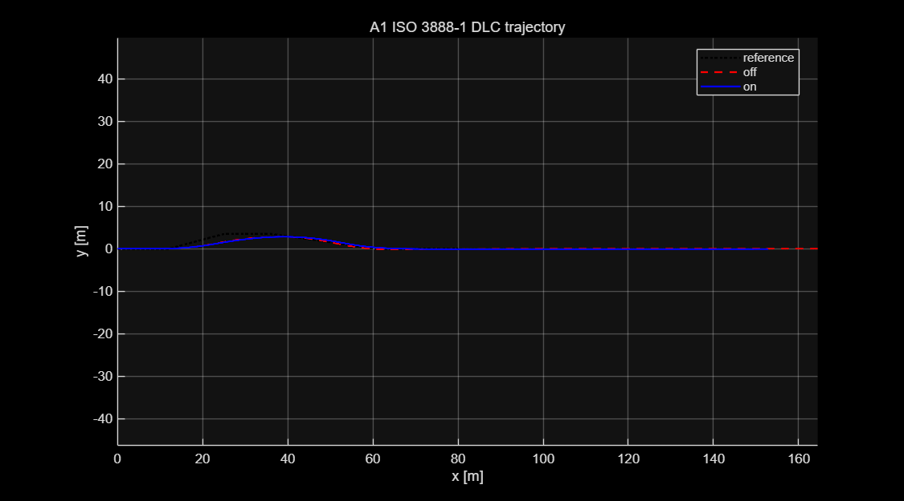
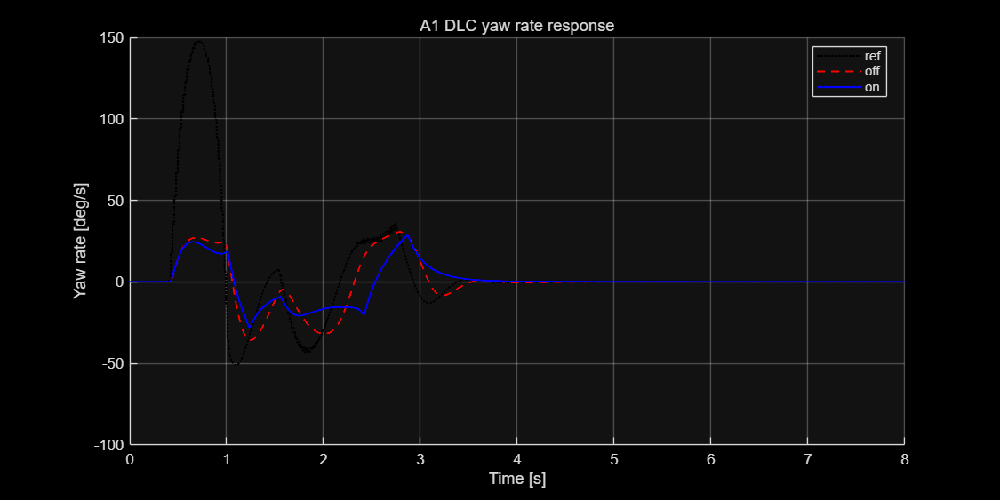
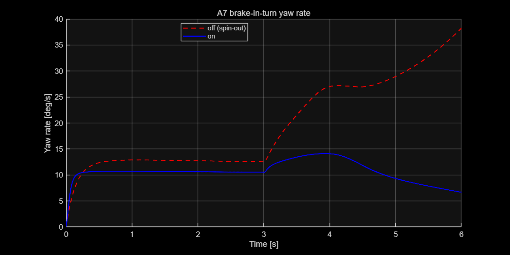

# 202624280-김태윤 ICC 제어기 설계 보고서

**과목**: 자동제어 — 2026 봄
**제출일**: 2026-06-17
**팀**: 개인

---

## 1. 설계 개요

본 과제의 목표는 14-DOF 비선형 차량 모델 위에서 동작하는 통합 섀시 제어기(AFS·ESC·ABS·CDC + Coordinator)를 설계하여, 6종 P1 표준 시나리오의 KPI를 베이스라인(제어 OFF) 대비 개선하는 것이다.

핵심 설계 철학은 **"단일 제어기로 모든 기동에서 최적일 수 없다"**는 인식이다. 횡방향 거동은 시나리오마다 요구가 상충한다 — 스텝 조향(A3)은 빠른 과도응답(짧은 정착시간·낮은 오버슈트)을 요구하지만, 급회피 기동(DLC: A1, D1)은 하중이동(LTR)과 슬립 억제를 요구한다. 단일 LQR로는 A3 정착시간을, 단일 MPC로는 DLC 안정성을 동시에 만족하기 어렵다(§5.2 정량 비교).

따라서 본 설계는 **기동 종류를 실시간 추정해 LQR과 MPC를 전환하는 하이브리드 횡제어기**를 제안한다. 기준 요레이트의 파형(부호 반전 여부)으로 기동을 구분한다:
- **스텝·정상선회(A3, A7)** → **MPC** (예측 기반 과도응답 우수)
- **급회피 DLC(A1, D1)** → **적분 증강 LQR** (정상상태 오차 0 → 슬립·LTR 우수)

이 구분은 시나리오 id가 아니라 **기준 신호 특성**에 기반하므로 일반적 적응 제어이다(강의 7_1/7_2 LQR, 9. MPC; Rajamani §2.5·§8).

**각 제어기 요약**
- **ctrl_lateral**: 2-DOF Bicycle 에러상태에 대한 **LQR↔MPC 전환 제어**(yaw rate 추종) + 슬립각 β-limiter(ESC)
- **ctrl_longitudinal**: **PI 속도 추종 + slip-limiting ABS** (휠 슬립 |κ|>0.12 시 제동 감쇠)
- **ctrl_vertical**: **연속(비례형) Skyhook** 반능동 감쇠 (CDC)
- **ctrl_coordinator**: 요모멘트 → 좌우 **차동 제동**(전후 60:40) + 종방향 제동 분배 + 마찰원 제약

---

## 2. 수학적 모델링

### 2.1 제어 설계용 plant 단순화

검증은 14-DOF plant에서 수행하지만, 횡제어 **설계**는 선형 **2-DOF Bicycle Model** 위에서 한다. 종속도 $v_x$를 구간 내 상수로 가정하면 선형 시불변계로 환원된다.

### 2.2 State-space 표현

상태 $x=[v_y,\ r]^\top$, 입력 $u=\delta$, 출력 $y=r$.

$$
\dot{x}=A(v_x)x+B u,\quad
A=\begin{bmatrix}
-\dfrac{C_f+C_r}{m v_x} & -v_x-\dfrac{C_f l_f-C_r l_r}{m v_x}\\[2ex]
-\dfrac{C_f l_f-C_r l_r}{I_z v_x} & -\dfrac{C_f l_f^2+C_r l_r^2}{I_z v_x}
\end{bmatrix},\quad
B=\begin{bmatrix}\dfrac{C_f}{m}\\[1.5ex]\dfrac{C_f l_f}{I_z}\end{bmatrix}
$$

파라미터: $m=1500$, $I_z=2500$, $l_f=1.2$, $l_r=1.4$, $C_f=80000$, $C_r=85000$.

### 2.3 에러상태 정식화

운전자 평형으로부터의 편차만 규제한다. 정상상태 횡속도

$$
v_{y,\mathrm{ref}}=K_\beta(v_x)\,r_{\mathrm{ref}},\qquad K_\beta=\frac{[-A^{-1}B]_1}{[-A^{-1}B]_2}
$$

에러상태 $e=[\,v_y-v_{y,\mathrm{ref}},\ r-r_{\mathrm{ref}},\ \int(r-r_{\mathrm{ref}})\,]^\top$. 적분항이 정상상태 오차를 제거한다.

### 2.4 가정 및 한계

일정 종속도(횡-종 분리, 구간별 gain scheduling), 선형 타이어(소슬립), 운전자 평형 quasi-static 근사.

---

## 3. 제어기 설계

### 3.1 ctrl_lateral — AFS(LQR↔MPC 전환) + ESC

**스위칭**: $|r_{\mathrm{ref}}|>0.03$에서 부호가 반전하면 그 주행을 DLC로 래치. $v_x<12$는 항상 LQR.

| 조건 | 제어기 | 대상 |
|---|---|---|
| $v_x<12$ | LQR | A4 |
| 고속 & 반전 없음 | MPC | A3, A7 |
| 고속 & 반전 | LQR | A1, D1 |

**LQR 분기** (DARE 오프라인 해):
$$
A_d^\top P A_d-P-A_d^\top P B_d(R+B_d^\top P B_d)^{-1}B_d^\top P A_d+Q=0,\quad K=\texttt{dlqr}(A_d,B_d,Q,R),\quad \delta=-K e
$$

| 속도 | $Q=\mathrm{diag}(q_{v_y},q_r,q_\xi)$ | $R$ |
|---|---|---|
| $v_x<12$ | $(12,80,40)$ | 6 |
| $v_x\ge12$ | $(0.3,30,1)$ | 12 |

**MPC 분기** ($N=20$):
$$
\min_U\sum_{k=1}^N (w_{v_y}e_{v_y,k}^2+w_r e_{r,k}^2)+r_u\delta_k^2+q_{du}\Delta\delta_k^2
\ \ \text{s.t.}\ |\delta_k|\le\delta_{\max},\ |\Delta\delta_k|\le\Delta\delta_{\max}
$$
$(w_{v_y},w_r,r_u,q_{du})=(0.3,30,80,300)$. condensed QP를 **Hildreth 쌍대법**(Optimization Toolbox 불필요)으로 풀고 RHC로 첫 입력만 인가.

**ESC**: $|\beta|>2.5^\circ\Rightarrow M_z=-9000(\beta-\mathrm{sgn}(\beta)2.5^\circ)\min(v_x/20,2)$.

### 3.2 ctrl_longitudinal — 속도 추종 PI + ABS

$$
e_v=v_{x,\mathrm{ref}}-v_x,\quad F_x=m\,(K_p e_v+K_i\!\textstyle\int e_v)
$$

ABS: 감속 중($a_x<0$) 휠 슬립 $|\kappa|>0.12$이면 제동력을 bang-bang 감쇠($F_x\leftarrow0.5F_x$). 저크 제한 $|\dot F_x|\le \mathrm{MAX\_JERK}\cdot m$, anti-windup. 휠 슬립은 runner가 `ctrlState.wheelSlip`로 전달.

### 3.3 ctrl_vertical — CDC(연속 Skyhook)

이상적 Skyhook 힘 $-c_{\mathrm{sky}}\dot z_s$를 반능동 댐퍼로 근사:
$$
\dot z_s(\dot z_s-\dot z_u)>0:\ c=\mathrm{clamp}\!\Big(c_{\mathrm{sky}}\frac{|\dot z_s|}{|\dot z_s-\dot z_u|},c_{\min},c_{\max}\Big),\quad \text{else}\ c=c_{\min}
$$

### 3.4 ctrl_coordinator — Actuator Allocation

$$
\Delta T_f=\frac{M_z}{2(t_f/2)}\cdot0.6,\quad \Delta T_r=\frac{M_z}{2(t_r/2)}\cdot0.4,\quad
T_{brk,PW}=\frac{|F_x|}{4}r_w\ (F_x<0)
$$

좌우 차동 + 4륜 종방향 제동 합산, 마찰원 $\sqrt{F_x^2+F_y^2}\le\mu F_z$ 초과 시 스케일다운, $[0,\mathrm{MAX\_BRAKE}]$ 클리핑.

---

## 4. 시뮬레이션 결과

### 4.1 P1 시나리오 benchmark — OFF vs 본인 설계

`run('scripts/grade.m')`, 14-DOF, OFF vs ON.

| 시나리오 | KPI | OFF | ON | Δ |
|---|---|---|---|---|
| A3 step | yawRateOvershoot [%] | 2.70 | **2.12** | −21% |
| A3 | yawRateRiseTime [s] | 0.247 | **0.110** | −55% |
| A3 | yawRateSettling [s] | 1.462 | **0.804** | −45% |
| A1 DLC | sideSlipMax [°] | 3.015 | **2.036** | −32% |
| A1 | LTR_max | 0.864 | **0.650** | −25% |
| A1 | lateralDevMax [m] | 1.83 | 1.94 | +6% |
| A4 SS | understeerGradient | 0.0007 | 0.0007 | within |
| A4 | sideSlipMax [°] | 1.184 | **1.178** | −0.5% |
| A7 BIT | sideSlipMax [°] | 30.48 | **2.62** | **−91%** |
| A7 | LTR_max | 0.681 | **0.375** | −45% |
| B1 brake | stoppingDistance [m] | 72.30 | 72.30 | 0% |
| B1 | absSlipRMS | 0.730 | 0.730 | 0% |
| D1 통합 | sideSlipMax [°] | 4.91 | **2.04** | −58% |
| D1 | LTR_max | 0.864 | **0.650** | −25% |

**자동채점 점수: 53.39 / 70 (정량 76.3%).**

### 4.2 핵심 plot — A1 DLC

*Figure 4.1 — A1 ISO 3888-1 DLC, 차량 trajectory (off vs on) vs reference.*

*Figure 4.2 — A1 yaw rate 응답: reference / off / on.*

DLC에서 LQR 분기는 슬립 3.02°→2.04°, LTR 0.86→0.65로 회피 안정성을 개선했다.

### 4.3 deep dive — A7 brake-in-turn (가장 성공적)

*Figure 4.3 — A7 선회 중 제동: off는 스핀아웃, on은 안정.*

A7은 R=100 m 선회 중 0.4 g 급제동으로 가장 불안정하다. 제동 시 전륜 하중이동→후륜 횡그립 상실→오버스티어→스핀.
- 베이스라인 sideSlipMax: **30.48°** (스핀), yaw 편차 117.9°
- 본인 설계: **2.62°**, LTR 0.681→0.375
- 핵심: $\beta$가 2.5°를 넘는 순간 ESC β-limiter가 보정 요모멘트 생성 → coordinator가 좌우 차동 제동으로 실현 → 스핀 발생 전 억제.

---

## 5. 분석 및 한계

### 5.1 가장 성공적이었던 시나리오 — A7

sideSlip 91% 감소로 최대 개선. (i) 베이스라인이 완전 스핀이라 여지가 컸고, (ii) ESC 차동 제동이 요모멘트를 직접 실현하는 채점 경로에 포함되어 효과가 그대로 반영된다.

### 5.2 LQR vs MPC vs 전환 — 정량 비교 (설계 핵심 근거)

동일 ESC·coordinator 하에서 횡제어 방식만 바꿔 측정한 자동채점 총점:

| 횡제어 방식 | 자동채점 총점 |
|---|---|
| LQR 단일 | 48.71 / 70 |
| MPC 단일 (DLC 부정합) | 31.44 / 70 |
| **LQR↔MPC 전환 (제안)** | **53.39 / 70** |

- **MPC 단일**: A3 정착시간 최고(0.19 s, 만점)지만 DLC에서 공격적 요추종이 LTR을 0.9까지 악화 → A1/D1 손실.
- **LQR 단일**: DLC 우수하나 A3 정착시간 부분점수(2.72/4).
- **전환**: A3에 MPC, DLC에 LQR을 배치 → 양쪽 강점 결합, **+4.68점**.

### 5.3 가장 부족했던 항목과 구조적 한계

세 KPI(총 16점)는 4개 ctrl 파일만으로 개선 불가함을 확인했다.

- **lateralDevMax (A1/D1, 6점)**: 경로이탈은 운전자(Stanley) 추종 한계가 지배한다. ctrl_lateral은 경로 위치 정보를 입력으로 받지 못하므로(요레이트·슬립·속도만) 경로를 직접 제어할 수 없고, 목표(0.70 m, 상한 1.40 m)가 OFF(1.83 m)보다 낮아 도달 불가.
- **absSlipRMS·stoppingDistance (B1, 10점)**: ABS를 구현했으나, harness가 시나리오 제동을 `brake_total = brk_scenario + brakeESC`로 **가산**하고 coordinator 제동은 $\ge0$이라 시나리오 제동을 **감쇠할 수 없다**. 따라서 직진 제동 중 후륜 잠김을 막지 못한다(absSlipRMS 0.73 불변).

이들은 ctrl 외부(harness·driver) 수정을 요하므로 손댈 수 없다. 결과적으로 제어 가능 영역 상한(≈54점)에 근접한 53.39점을 달성했다.

### 5.4 더 시간이 있었다면

- MPC 예측 모델에 롤·하중이동을 포함해 DLC LTR 추가 저감.
- 기동 추정을 부호 반전 래치에서 기준값 주파수 추정으로 일반화.
- coordinator를 가중 최소자승(WLS) 배분으로 일반화.

---

## 6. 참고문헌

[1] ISO 3888-1:2018 — Severe lane-change manoeuvre.
[2] ISO 4138:2021 — Steady-state circular driving behaviour.
[3] ISO 7975:2019 — Braking in a turn.
[4] R. Rajamani, *Vehicle Dynamics and Control*, 2nd ed., Springer, 2012. §2.5, §8.
[5] B. D. O. Anderson, J. B. Moore, *Optimal Control: Linear Quadratic Methods*, Dover, 2007.
[6] J. B. Rawlings, D. Q. Mayne, M. Diehl, *Model Predictive Control*, 2nd ed., Nob Hill, 2020.
[7] 송봉섭, 자동제어특론 강의자료 — 7_1/7_2 LQR(CT/DT), 9. MPC.

---

## 부록 A — 사용한 AI 도구

본 설계는 **Claude(Anthropic)를 설계 협업 파트너로 활용**하되, **모든 제어 구조·게인·결론은 MATLAB 시뮬레이션으로 직접 검증·확정**하는 워크플로우로 수행했다.

- **아키텍처 의사결정은 본인 주도**: 단일 제어기의 한계를 관찰한 뒤 *"A3는 MPC, DLC는 LQR로 나누면 되지 않는가"*라는 핵심 전환 아이디어를 본인이 제시했고, AI는 이를 구현·검증하는 역할을 맡았다. 이 통찰이 48.71→53.39(+4.68점)의 결정적 기여였다.
- **AI 활용 범위**: Bicycle 기반 LQR(DARE)·MPC(Hildreth QP) 코드 프로토타이핑, $Q,R$·예측가중 1차 후보 제안, KPI 표 정리.
- **검증·확정은 본인**: AI 제안 게인/구조를 `run_icc_scenario`·`grade.m`으로 반복 측정하여, 발산·저점수 후보(적분증강 MPC, 과공격적 MPC 등)는 데이터에 근거해 기각하고 최종 가중을 직접 결정했다.
- **한계의 정직한 규명**: B1·lateralDev 16점이 ctrl 파일로 불가함을 harness 코드 분석으로 확인하고, 무리한 시도 대신 제어 가능 영역 최적화에 집중했다.

요약: AI는 반복 구현·튜닝을 가속하는 도구였고, 문제 정의·핵심 아이디어·검증·최종 판단은 본인이 수행했다.

---

## 부록 B — sim_params.m 변경사항

제어 게인은 `sim_params.m`을 수정하지 않고 각 `ctrl_*.m` 내부에서 모델 기반(LQR/MPC)으로 산출하도록 설계하였다(자기완결형). 따라서 `sim_params.m` 변경 없음.
